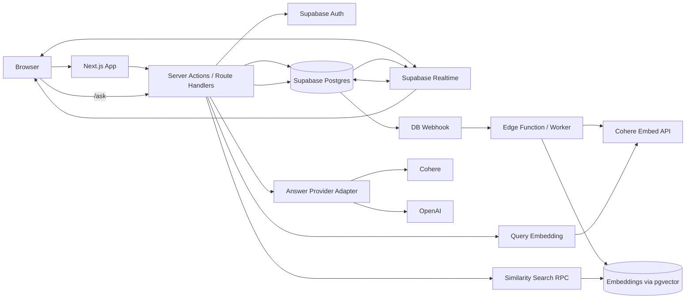
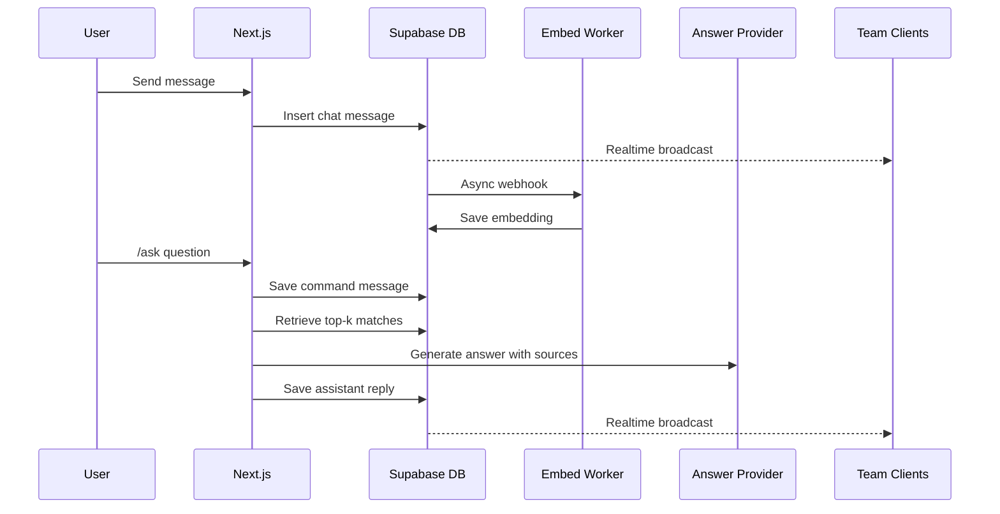

# Org Context v1 Architecture

## Summary
Org Context v1 is a Next.js App Router application rooted in `main/` that gives teams a shared workspace with one built-in realtime group chat channel per workspace. Users can sign up with email and password, create multiple workspaces, invite existing users into those workspaces, chat in realtime, and use `/ask` inside the group chat to run retrieval over prior chat history and generate an answer with cited sources.

The backend is Supabase-first:
- Supabase Auth for email/password authentication
- Supabase Postgres for application data
- `pgvector` for chat message embeddings
- Supabase Realtime for chat updates
- Supabase webhook plus Edge Function or worker for asynchronous message embedding

Embeddings always use Cohere. Answer generation for `/ask` is workspace-configurable between Cohere and OpenAI.

## Product Scope
### Included in v1
- Landing page at `/`
- Email/password signup and login
- Dashboard with support for multiple workspaces per user
- One built-in realtime group chat channel per workspace
- Existing-user workspace invitations
- Message embedding after send
- `/ask` retrieval and answer generation with source references

### Not included in v1
- Multiple channels per workspace
- Direct messages
- File uploads or document ingestion
- Cross-workspace retrieval
- Per-user API keys
- Advanced admin tooling

## Core Components
- `main/` Next.js App Router frontend and server routes
- Supabase Auth for identity and sessions
- Supabase Postgres for workspaces, memberships, invites, chat, and embeddings
- Supabase Realtime for live chat updates
- Supabase database webhook or trigger path for new message embedding jobs
- Supabase Edge Function or equivalent worker for asynchronous Cohere embedding requests
- Cohere embeddings for chat indexing and retrieval
- Cohere or OpenAI answer generation for `/ask`

## System Architecture

## Chat and Retrieval Workflow

## Main Flows
### Authentication flow
1. Visitor lands on `/`.
2. Visitor signs up or logs in with email and password.
3. Signup collects `full_name` and `company_name`.
4. Successful auth redirects the user to `/dashboard`.
5. Session-aware guards protect dashboard and workspace routes.

### Workspace flow
1. Authenticated user creates a workspace from the dashboard.
2. System creates the workspace record.
3. System adds the creator as `owner` in workspace membership.
4. System creates a default `general` channel.
5. Owner can invite existing registered users into the workspace.

### Chat flow
1. Member opens `/workspaces/[workspaceId]`.
2. Client subscribes to chat updates via Supabase Realtime.
3. User sends a message.
4. Message is inserted immediately and broadcast to all workspace members.
5. Embedding is generated asynchronously after insert.

### `/ask` flow
1. User sends `/ask <question>` in the workspace chat.
2. The original command is stored in chat as a visible command message.
3. The query is embedded with Cohere.
4. A similarity search ranks matching chat messages from the same workspace channel.
5. Top results are passed to the selected answer provider.
6. The generated answer is inserted as an assistant message with source references.

## Design Decisions
- One default channel only in v1 to keep workspace chat simple.
- Retrieval is limited to the current workspace chat to avoid cross-workspace leakage.
- Message embedding runs asynchronously so chat send latency stays low.
- Answer provider is configurable per workspace, but embeddings always use Cohere.
- Supabase is the primary backend service to minimize custom infrastructure in v1.

## High-Level Route Layout
- `/` landing page
- `/login`
- `/signup`
- `/dashboard`
- `/workspaces/[workspaceId]`

## Operational Boundaries
- Client code may use only public Supabase keys.
- Service-role and model-provider keys stay server-only.
- Assistant replies and embedding jobs run through trusted server-side paths.
- Non-members must never be able to read workspace chat or retrieval results.
